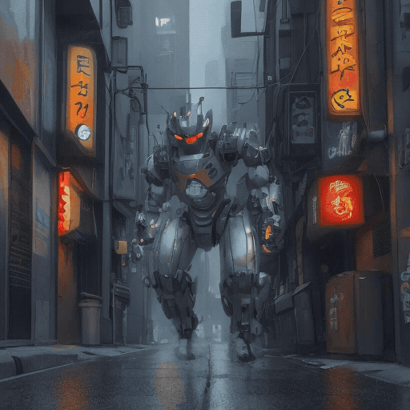

# NPU Motion Studio

**2枚の画像の「ありえない途中」を作る。ロボット→犬、廃墟→都市、ラフ→完成品。すべてPC内で。**

[English](README.md) · [設計](docs/architecture.md) · [実測](docs/benchmarks.md)

一般的な画像→動画AIは、1枚の絵を少し動かすものが中心です。NPU Motion Studioは**最初のAと
最後のBを自分で決め、その間にある「ありえない変化」をAIで描きます。** 画像を2枚入れ、
「装甲が毛に変わり、機械の脚が犬の足になる」と一文書いて、作成ボタンを押すだけです。

MVの場面転換、ショート動画、作品のビフォーアフター、製品コンセプト、ミーム、奇妙な映像実験に
使えます。クラウドへの画像送信、順番待ち、複雑なノード操作はありません。上のロボット→犬も、
このアプリが1台のノートPCで実際に作った動画です。

## 特徴

- 既定は強力な **A→Bモード**。先頭=A、最後=Bを固定します。
- Aの縦横比を維持し、Bを無理に引き伸ばしません。
- 日本語をローカル翻訳し、ダンス・建築・走行・変形などを各NPU画像へ反映します。
- 英語プロンプトにも直接対応します。
- CPU=文章理解、NPU=画像生成、Arc GPU=画像化と補間、Quick Sync=MP4書き出し。
- 日本語／Englishを画面右上で切り替えられます。
- 入力画像や文章を外部サービスへ送りません。
- 2枚・一文・作成ボタンだけ。難しい機器設定は画面の裏側へ隠しています。

## こんな映像を作れます

- ロボット→犬、人物→怪物、昼→夜など、まったく違う姿への変身
- ラフスケッチ→完成品、古い建物→未来都市など、制作過程の見せ方
- MV・SNS動画・ゲーム映像に使える、短く強い場面転換
- 正解を決めずに試す、変で面白いローカルAI実験

## 使い方

1. 初回だけ `setup_windows.bat` をダブルクリックします。
2. 普段は `run_windows.bat` をダブルクリックします。
3. A・最初の画像とB・最後の画像を選びます。
4. 「ロボットの装甲が毛になり、本物の柴犬へ変身する」のように、**途中で何が起こるか**を書きます。
5. 迷ったら「ダイナミック」を選び、作成ボタンを押します。

画像AIや補間ツールは初回セットアップ時に取得され、GitHubにはモデル本体を含めません。

## 実測

Core Ultra 7 258V / Intel AI Boost / Arc 140V / OpenVINO 2025.4.1。

| 内容 | 合計 |
|---|---:|
| A→B、ダイナミック、8枚、4秒 / 96コマ | **11.61秒** |
| ロボット→犬、高品質、12枚、5秒 / 120コマ | **20.69秒** |
| 1枚、すばやく、4枚、3秒 / 47コマ | **5.80秒** |
| 高品質、12枚、建築、5秒 | **15.39秒** |

1台でのウォーム状態の実測であり、すべての入力やPCへの保証値ではありません。

## 正直な限界

- AI画像間で顔・服・車体の細部が少し変わることがあります。
- まったく違う物への変身は途中がシュールになることがあり、部品構造も工学的に正しいとは限りません。
- 複数人の格闘や、道具を正確に持ち替える動作はまだ苦手です。

アプリのコードはMIT Licenseです。モデルと依存ツールには別のライセンスがあります。
[MODEL_MANIFEST.json](MODEL_MANIFEST.json)も確認してください。
