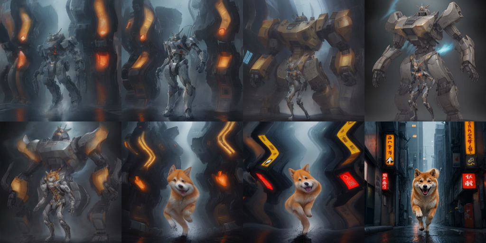

<div align="center">

# NPU AI Video

**Turn one image into a little movie — or make the impossible middle between A and B.**

[](https://www.microsoft.com/windows/)
[](https://www.python.org/)
[](https://github.com/openvinotoolkit/openvino)
[](https://github.com/taichiro20100723-droid/npu-motion-studio/actions/workflows/ci.yml)
[](LICENSE)

[Download releases](https://github.com/taichiro20100723-droid/npu-motion-studio/releases) · [日本語](README.ja.md) · [Architecture](docs/architecture.md) · [Benchmarks](docs/benchmarks.md)

</div>

<p align="center">
  
</p>

> **The hook:** give it a start and an end. NPU AI Video draws the strange, beautiful journey between them — on your own Intel laptop.

Most image-to-video tools animate one still. This app is built for the moment people want to replay and share: **robot → dog, sketch → product, ruin → city, letters → alien glyphs**. Pick a mode, add a short idea, and press one large button. There is no cloud upload, node graph, account, or server queue.

## Start in three moves

1. Download the latest release, or clone this repository.
2. Double-click **`setup_windows.bat`** once. It creates the environment and downloads the optional local models and tools.
3. Double-click **`run_windows.bat`**, choose a mode, and make a short clip.

The first setup downloads approximately 1 GB of image-model files and 230 MB of frame-interpolation files. They stay outside Git. The app listens on `127.0.0.1` only, and generated videos are written to `.runtime/outputs/`.

### Requirements

- Windows 11
- Python 3.12
- Intel Core Ultra with Intel AI Boost NPU
- Intel Arc graphics and current Intel drivers
- Approximately 3 GB of free space for the optional runtime, models, and cache

The included `mock` engine also runs without models, so the UI and tests can be explored on another machine.

## Choose your kind of magic

| Mode | Input | Best for |
| --- | --- | --- |
| **Transform A → B** | Two images + one sentence | Reveals, before/after, memes, music-video transitions |
| **Animate one image** | One image or a prompt | Camera moves, wind, neon, loops, short posts |
| **AI Character Stage** | Text or a character-sheet image | Distorted lettering, title cards, shareable symbols |
| **Motion Brush** | An image + red/blue brush strokes | Pointing the subject and protecting the background |

Try these first:

- **Robot → Shiba Inu:** “The robot opens its armor and transforms into a Shiba Inu running toward the camera.”
- **Neon night:** “A rainy neon street. The camera glides sideways while the lights shimmer.”
- **Letters → alien glyphs:** “The letters burst into glowing particles and reform as alien symbols.”

The UI turns these ideas into buttons, so a beginner does not need prompt jargon. The final video can be saved as an MP4; character-stage users can also download the generated SVG sheet.

## Why it is fast and local

The whole Intel chip gets a job:

```text
Japanese / English idea
          │
          ▼
CPU: local translation + motion timeline
          │
          ▼
NPU: prompt-aware keyframe images
          │
          ▼
Arc GPU: VAE decode + frame interpolation
          │
          ▼
Intel Quick Sync: H.264 MP4
```

The hybrid design is intentional. It is not marketed as a full video-diffusion model: it protects exact endpoints, redraws prompt-aware key moments, warps motion, interpolates similar frames, and encodes locally. Radical transformations can still become surreal in the middle — that is part of the experiment, not a hidden failure mode.

## Real outputs and measured speed

The repository includes outputs from the test laptop:



[Watch the robot → dog MP4](examples/robot-to-dog/robot-to-dog.mp4) · [Watch the Motion Brush run](examples/motion-brush/robot-to-dog-motion-brush.mp4) · [See a single-image loop](examples/showcase/one-image-loop.gif)

Measured on one Core Ultra 7 258V laptop with Windows 11, Intel AI Boost NPU, Intel Arc 140V, and OpenVINO 2025.4.1:

| Workflow | NPU work | Arc GPU work | Total |
| --- | ---: | ---: | ---: |
| One image, Fast, 3 sec / 47 frames | 3.13 sec | 1.27 sec RIFE | **5.80 sec** |
| A → B Dynamic, 8 anchors, 4 sec / 96 frames | 7.94 sec | 1.97 sec RIFE | **11.61 sec** |
| Robot → dog, 12 anchors, 5 sec / 120 frames | 15.25 sec | 3.99 sec RIFE | **20.69 sec** |

These are warm-run measurements from one machine, not universal promises. The first NPU compilation can take minutes; cached launches on the test machine took roughly 6–7 seconds before generation.

## Development

```powershell
py -3.12 -m venv .venv
.\.venv\Scripts\python.exe -m pip install -e ".[production,dev]"
.\.venv\Scripts\python.exe -m ruff check .
.\.venv\Scripts\python.exe -m pytest -q
node --check src/npu_motion_studio/web/app.js
```

Run the model-free UI locally with:

```powershell
.\.venv\Scripts\python.exe -m npu_motion_studio
```

The main UI lives in `src/npu_motion_studio/web/`; the Python API is intentionally small and local-only. See [CONTRIBUTING.md](CONTRIBUTING.md) before opening a pull request.

## Music-video builder (experimental)

`make_waseda_saga_festival_mv.bat` is a local recipe for audio-aware cuts and transitions. It uses face-free backgrounds by default. Before publishing any output, confirm permission for every photograph, song, logo, and school asset.

## Honest limitations and licenses

Identity, hands, clothing, vehicle details, multi-person interaction, and precise hand-offs can drift between AI keyframes. Results vary with prompts, images, heat, drivers, and model versions.

The application code is MIT licensed. OpenVINO, downloaded models, FFmpeg, and RIFE have their own licenses. Model files and runtime binaries are excluded from Git; review [MODEL_MANIFEST.json](MODEL_MANIFEST.json) before redistribution or commercial use.

Contributions are welcome: new Intel NPU benchmark runs, safe example assets, motion ideas, and small bug fixes are especially useful.
