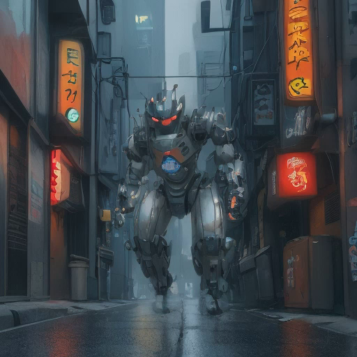
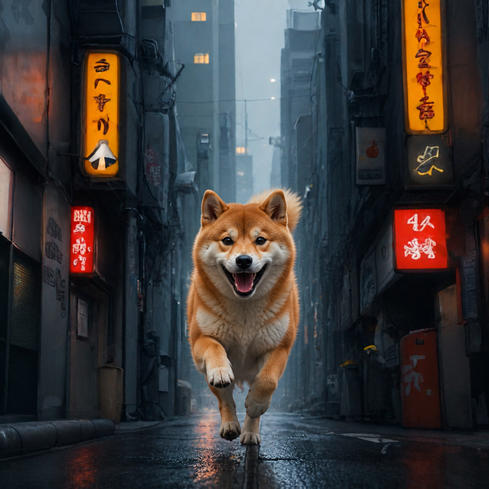
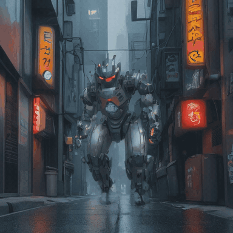

<div align="center">

# NPU Motion Studio

**Make the impossible middle: robot → dog, sketch → product, ruin → city. Locally.**

[](https://www.microsoft.com/windows/)
[](https://www.python.org/)
[](https://github.com/openvinotoolkit/openvino)
[](LICENSE)

[日本語](README.ja.md) · [Architecture](docs/architecture.md) · [Benchmarks](docs/benchmarks.md)

</div>


Most image-to-video tools animate one still. **NPU Motion Studio starts with two exact endpoints and creates
the impossible journey between them.** Drop in image A and image B, write one sentence—“metal armor folds into
orange fur”—and the app asks the NPU to draw a transformation timeline while the Arc GPU turns it into a smooth
MP4. No cloud upload, no node graph, and no server queue.

Use it for music-video transitions, short films, concept reveals, before/after shots, product transformations,
memes, and weird visual experiments. The included robot→dog clip is a real output from the app on one laptop.

> This is not a full video-diffusion model. It is a deliberately fast hybrid: prompt-aware NPU keyframes,
> motion warping, GPU interpolation, and hardware video encoding.

## Why it feels different

- **A and B are sacred** — the decoded MP4 starts at A and ends at B, apart from normal H.264 compression.
- **The prompt actually drives time** — Japanese is translated locally; English goes directly into the motion
  classifier and every NPU keyframe prompt.
- **The whole Intel chip gets a job** — CPU for language, NPU for diffusion, Arc GPU for VAE + RIFE, and
  Quick Sync for H.264.
- **Aspect ratio is preserved** — A defines the output shape; B is contained without stretching.
- **Bilingual, beginner-friendly UI** — switch between English and Japanese with one click.
- **No hard 10-second limit** — quality modes can spend more time drawing better transitions.
- **Made for rapid experiments** — two images, one sentence, one Create button; the technical pipeline stays hidden.

## Two creation modes

### 1. Transform A → B (default)

<p align="center">
  
  <strong>&nbsp;→&nbsp;</strong>
  
</p>

The default experience. Pick two images and describe the process—not just the destination. The engine creates
4, 8, or 12 anchor moments, locks A/B at the ends, and interpolates the final sequence on the Arc GPU.

Example prompt:

```text
A colossal steel battle robot transforms into a real Shiba Inu while sprinting toward the camera. Metal plates
fold into orange fur, mechanical legs become paws, and the final real dog runs joyfully through the same alley.
```

[Watch the 5-second MP4](examples/robot-to-dog/robot-to-dog.mp4) ·
[See eight sampled moments](examples/robot-to-dog/robot-to-dog-contact-sheet.png)

### 2. Animate one image



Use a prompt, one image, or both. With seamless loop enabled, the final frame returns to A.

## Measured on a Core Ultra 7 258V

Windows 11 · Intel AI Boost NPU · Intel Arc 140V · OpenVINO 2025.4.1.

| Workflow | NPU work | Arc GPU work | Total |
|---|---:|---:|---:|
| A→B Dynamic, 8 anchors, 4 sec / 96 frames | 7.94 sec | 1.97 sec RIFE | **11.61 sec** |
| Robot→dog High quality, 12 anchors, 5 sec / 120 frames | 15.25 sec | 3.99 sec RIFE | **20.69 sec** |
| One image Fast, 4 anchors, 3 sec / 47 frames | 3.13 sec | 1.27 sec RIFE | **5.80 sec** |
| High quality build sequence, 12 anchors, 5 sec | 11.11 sec | 2.42 sec RIFE | **15.39 sec** |

These are warm-run measurements from one laptop, not universal guarantees. The first NPU compilation can take
minutes; cached launches took roughly 6–7 seconds on the test machine.

## Quick start on Windows

Requirements: Windows 11, Python 3.12, an Intel Core Ultra NPU, an Intel Arc GPU, and current Intel drivers.

1. Download or clone this repository.
2. Double-click **`setup_windows.bat`** once. It downloads the optional AI runtime, image model, translator, and
   RIFE binary. Models are not stored in Git.
3. Double-click **`run_windows.bat`** whenever you want to create.
4. Choose A and B, write the motion prompt, and press **Create the A-to-B video**.

Everything listens on `127.0.0.1` only. Generated videos are stored under `.runtime/outputs/`.

## How the pipeline works

```text
Japanese / English prompt
          │
          ▼
CPU: local translation + action timeline
          │
          ▼
NPU: 4 / 8 / 12 prompt-aware anchor images
          │
          ▼
Arc GPU: VAE decode + RIFE Vulkan interpolation
          │
          ▼
Intel Quick Sync: H.264 MP4
```

The A→B path blends endpoint conditions with a smoothstep schedule, gives the NPU more freedom at the hybrid
midpoint, then increasingly protects the real B image near the end. Each anchor gets an exact progress cue and
an action-specific motion warp; independent AI images are never simply cross-faded. After RIFE, the first and
last decoded frames are replaced with A and B again before encoding.

## Quality modes

| UI | Anchors | Intended use |
|---|---:|---|
| Fast | 4 | Quick experiments |
| Dynamic | 8 | Default; the best motion/time balance |
| High quality | 12 | More intermediate changes and higher prompt fidelity |

Video length is 2–10 seconds. The 180-second scheduler is a safety ceiling, not a target.

## Development

```powershell
py -3.12 -m venv .venv
.\.venv\Scripts\python.exe -m pip install -e ".[production,dev]"
.\.venv\Scripts\python.exe -m pytest -q
.\.venv\Scripts\python.exe -m ruff check .
```

The default `mock` engine runs without models and is useful for UI work:

```powershell
.\.venv\Scripts\python.exe -m npu_motion_studio
```

## Project map

- `src/npu_motion_studio/engines/openvino_lcm.py` — NPU generation, A/B locking, aspect-ratio handling
- `src/npu_motion_studio/dynamic_motion.py` — dance, build, drive, run, fly, transform, flow, camera timelines
- `src/npu_motion_studio/prompting.py` — offline Japanese translation and action classification
- `src/npu_motion_studio/engines/rife_vulkan.py` — Arc GPU frame interpolation
- `src/npu_motion_studio/engines/video_pipeline.py` — fallback flow and Quick Sync MP4 output
- `src/npu_motion_studio/web/` — build-free bilingual UI
- `MODEL_MANIFEST.json` — model and license boundaries

## Honest limitations

- Identity, hands, clothing, and vehicle details can drift between AI anchors.
- Radical transformations can look surreal in the middle; mechanical part topology is not guaranteed.
- Multi-person interaction and precise object hand-offs remain difficult.
- The included samples are real outputs from the test PC; results vary with prompts, images, heat, and drivers.

## Models, binaries, and licenses

The application code is MIT licensed. Downloaded models, OpenVINO, FFmpeg builds, and RIFE have their own
licenses. Model files and runtime binaries are excluded from Git. Review [MODEL_MANIFEST.json](MODEL_MANIFEST.json)
before redistribution or commercial use.

Contributions, benchmark results from other Intel NPU laptops, and weird A→B experiments are welcome.
